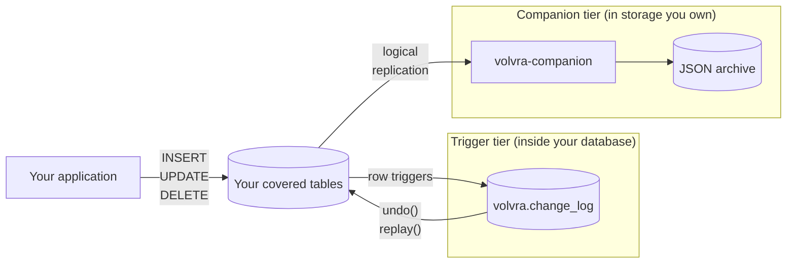

# pgVolvra

[](https://github.com/pgEdge/pgvolvra/actions/workflows/test.yml)

Verified on PostgreSQL 14, 15, 16, 17, 18, and 19 before every release.

Row-level undo and history for PostgreSQL.

## Table of Contents

- [Overview](docs/index.md)
- [Architecture](docs/architecture.md)
- [Getting Started](docs/quick_start.md)
- [Examples](docs/examples.md)
- [Installing pgVolvra](docs/installation.md)
- [Verifying a Managed Provider](docs/managed_providers.md)
- [pgVolvra and Backups](docs/backups.md)
    - [Configuring pgVolvra](docs/configuration.md)
    - [Upgrading pgVolvra](docs/upgrading.md)
- [Covering Tables](docs/covering_tables.md)
- [Undoing Changes](docs/undoing_changes.md)
- [Viewing History](docs/viewing_history.md)
- [Monitoring](docs/monitoring.md)
- [Managing Retention](docs/retention.md)
- [Verifying History Integrity](docs/integrity.md)
- [Erasing Data](docs/erasure.md)
- [Performance](docs/performance.md)
- [Using the Durable Tier](docs/companion.md)
    - [Companion Reference](docs/companion_reference.md)
- [Security](docs/security.md)
- [Function Reference](docs/function_reference.md)
- [CLI Reference](docs/cli_reference.md)
- [Troubleshooting](docs/troubleshooting.md)
- [FAQ](docs/faq.md)
- [Release Notes](docs/changelog.md)
- [Developer Resources](docs/developers.md)

pgVolvra reverts the exact rows changed by a mistaken UPDATE, DELETE, or
migration, rather than rolling an entire cluster back to a point in
time. PostgreSQL has no equivalent of Oracle Flashback, so recovering
from a mistaken statement normally means restoring a backup and
discarding every other change made since.

pgVolvra installs as plain SQL. pgVolvra requires no compiled extension,
no PostgreSQL extensions at all, no superuser, and no access to the
database server filesystem, which is what managed providers withhold.
pgVolvra is verified on Supabase and on Neon, where verification runs
pass on the free plan, and is designed for Amazon RDS, Amazon Aurora,
and Google Cloud SQL on the same basis. See
[Verifying a Managed Provider](docs/managed_providers.md) for what has
been verified on which service.

pgVolvra records changes from the moment you cover a table, and cannot
recover a change made before that point. Setup is therefore the whole
job.

## How pgVolvra Works

pgVolvra has two independent capture tiers. You can run either one on
its own, or both together. The following diagram shows where each one
sits:



The trigger tier is the everyday undo, and it lives entirely inside
your database. Row triggers write the row image before the change and
the row image after it into `volvra.change_log`, in the same
transaction as your write. Nothing runs outside the database, so this
tier works anywhere PostgreSQL runs, including managed providers that
allow no extensions.

The companion tier is the durable copy, and it lives outside your
database. A small process reads changes through logical replication and
writes them to storage you own, as newline-delimited JSON with a
manifest chaining SHA-256 hashes. You can read that archive without
pgVolvra and without PostgreSQL, so the history survives the loss of
the database.

Neither tier needs the other. They observe the same tables and write to
different places. The following table compares them:

| Property | Trigger tier | Companion tier |
|---|---|---|
| What it gives you | Everyday undo and history | History that outlives the database |
| How it captures | Row triggers on your tables | An external process reading logical replication |
| Where history is kept | A table in the same database | Files in storage you own |
| When it is written | Synchronously, in your transaction | Asynchronously, shortly after |
| Survives loss of the database | No | Yes |
| Requires wal_level = logical | No | Yes |
| Requires REPLICA IDENTITY FULL | No | Yes |
| Recovers a TRUNCATE | Yes, by default | No |
| Needs a superuser | No | No |
| Runs on managed providers | Yes | Yes, given a REPLICATION grant |

Most deployments use the trigger tier alone. Add the companion when the
history must survive the database itself. The one place the two meet is
recovery: after restoring a backup, the archive can refill
`volvra.change_log`, and undo and replay then work as they always did.
The [Architecture](docs/architecture.md) document explains both in
detail.

## Installation

pgVolvra requires PostgreSQL 14 or later and no PostgreSQL extensions.
Install pgVolvra by running one file against your database:

```bash
psql "$DATABASE_URL" -f sql/volvra.sql
```

The file is pure SQL wrapped in a single transaction, so any client
works, a failed install leaves nothing behind, and a managed
provider's browser SQL console can run the file directly.

Install pgVolvra as a dedicated role that is not a superuser. The
capture function is SECURITY DEFINER, so a superuser owner turns every
write on a covered table into superuser-owned code. For details of
every installation method, see
[Installing pgVolvra](docs/installation.md).

Self-hosted users who prefer `CREATE EXTENSION` can build optional
packaging from the same SQL file; see the `extension` directory.
pgVolvra is not a PostgreSQL extension, and nothing depends on that
packaging.

## Configuration

pgVolvra works with no configuration. Settings live in the
`volvra.settings` table and change the capture, retention, and
integrity behavior:

```sql
SELECT volvra.set_setting('retention_default', '30 days');
SELECT volvra.set_setting('strict_roles', 'on');
```

For every setting, its default, and what the setting controls, see
[Configuring pgVolvra](docs/configuration.md).

## Using pgVolvra

Cover the tables where a wrong statement would be expensive, then
revert mistakes as they happen. Cover a schema and confirm what has an
undo:

```sql
SELECT * FROM volvra.enable_all('public');
SELECT table_name, covered FROM volvra.status();
```

Find the transaction that caused the damage, preview the undo, and
apply it:

```sql
SELECT txid, tables, updates FROM volvra.transactions();
SELECT * FROM volvra.preview_undo_txid(848291);
SELECT * FROM volvra.undo_txid(848291, confirm => true);
```

The command line tool shows the plan, asks once, and then applies:

```bash
volvra log -n 5
volvra undo --txid 848291
```

Schedule one maintenance job, which extends partitions, applies
retention, and seals the history:

```sql
SELECT * FROM volvra.maintain();
```

For the full range of ways to select what to revert, see
[Undoing Changes](docs/undoing_changes.md). For the durable tier that
archives change data to storage you own, see
[Using the Durable Tier](docs/companion.md).

## Documentation

The documentation in the `docs` directory builds with MkDocs and the
Material theme. Install the pinned dependencies and serve the site
locally:

```bash
pip install -r requirements.txt
mkdocs serve
```

The pins match the primary pgEdge documentation site. For details, see
[docs/developers.md](docs/developers.md).

For more information, visit
[docs.pgedge.com](https://docs.pgedge.com).

## Support & Resources

For more information, visit
[docs.pgedge.com](https://docs.pgedge.com).

To report an issue with the software, visit
[the issues page](https://github.com/pgEdge/pgvolvra/issues).

## Contributing

We welcome your project contributions; for more information, see
[docs/developers.md](docs/developers.md).

The `DECISIONS.md` file records the design and vocabulary decisions
that have already been argued, including what each choice beat and why
the alternative lost.

## License

This project is licensed under the
[PostgreSQL License](LICENSE.md).
